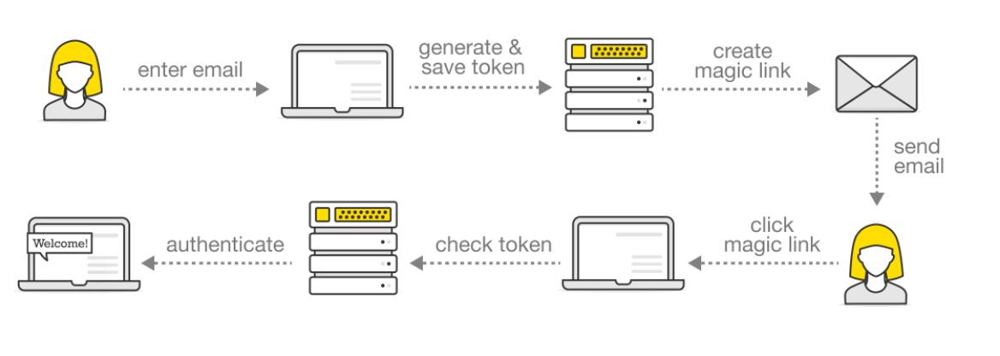

## What is no-secreto?

no-secreto is a library to help you add passwordless authentication in your nodejs applicaiton.

## How does no-secreto work?

## Where is the generated OTP stored?

The generated OTP is stored on your device. It is not stored on a different server
