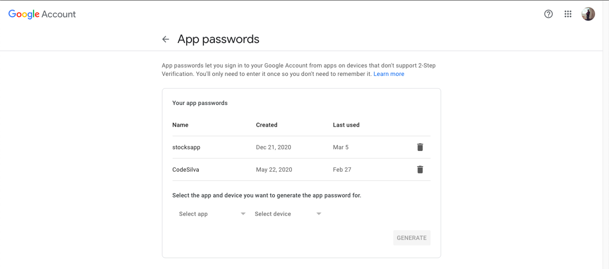
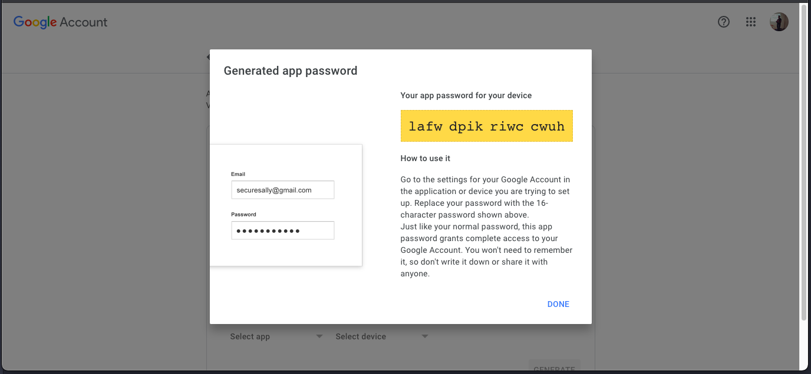

# Set Email Details

In order to send OTP to the user, we need to set the email details.

# By Using Default Settings

Under the hode, no-secreto uses **nodemailer** to send OTP to the user. The default settings are:

    {
      "host": "smtp.gmail.com",
      "port": 465,
      "secure": false,
    }

Follow the steps below to set the email details using the default settings:

### Step-1

As of 02/05/2022, Gmail has changed the password policy. You will need to generate a new password for your application, in order to use Gmail as your email service. You can do this by following the steps below:

- Go to https://myaccount.google.com/ and in the left sidebar click in Security, find "Signing in to Google", click in 2-Step Verification and enable it.

- After enabling 2-Step Verification you'll see another option that is App Passwords. Click on this option and you'll see a page like the one shown below in the image.



To create a new app password click "Select app" combobox, select Other, define a name and click in Generate. A dialog box will appear with the password. See below.



copy the password and paste it in the `password` field at Step-2.

### Step-2

Use the following code to set the email details:

```javascript
import { setEmailDetails } from "no-secreto";

const setDetails = setEmailDetails("your@emailid.com", "yourpassword");
```

This will set email details and return true

# By Using Custom Settings

You can also use another smtp provider to send OTP to the user.

```javascript
import { updateDetails } from "no-secreto";

*/
@param {string} smtp host
@param {number} port
@param {boolean} ssl
*/
updateDetails("smtp.outlook.com", 587, false);
```

This will update the default email details and return true

:::note

You need to set the email details before sending OTP to the user.

:::
